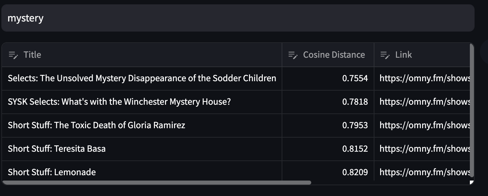

# Podcast-Episode-Recommender-Embeddings
Using word embeddings to generate podcast episode recomendations.

An improvement on my [previous project](https://github.com/jmoro0408/Podcast_Episode_Recommender).

So you loved that Stuff You Should Know (SYSK) episode on The Dyatlov Pass Mystery, and want to know which other episodes Josh and chuck have that might be similar? Well with over 1500 episodes, it can be hard to choose.

This project uses a vector database (ChromaDB) and the all-MiniLM-L6-v2 sentence transformer to find episodes based on keyword searches. 

Full SYSK Transcripts generously provided by OSF1.

Checkout the final steamlit app [here](https://podcast-episode-recommender-embeddings-h4idhrh5swcfbzlq3dqqqj.streamlit.app/)!

Blog post on this project with details on word embeddings and ChromaDB coming soon!

### Data Stats
* Dataset consists of 2044 episodes in total
* Average length of transcript: 35,485 words
* Total of 72,531,340 words in the entire corpus

## How to use 

The search seems to work best with short phrases or single keywords, for example the search for `mystery` produces good results:

## How I built this
### Transcript storage
I first use pandas to read the provided parquet files and subsequently write them to a local postgresql database.
Storing the files in a database allows for easy access for the rest of the project.

### Text Preprocessing

Preprocessing is generally the most important and labour intensive part of natural language processing and in broader machine learning and this project is no exception.
I used two popular NLP packages to undertake preprocessing: spacy and nltk. This involved:
1. Removing stopwords and punctuation. I append my own custom stopwords (contained in "custom_stopwords.txt") to spacy's built in stopwords. These custom stopwords generally consist of common SYSK sponsors, and Josh and Chuck's full names.
2. Lemmatization. I use NLTK's WordNetLemmatizer to reduce the words to their lemmas.

Notably the preprocessing was much less intensive than the previous LDA modelling.

### ChromaDB and word embeddings

The real magic is built into the [ChromaDB](https://www.trychroma.com/). I use this library to encode each episode into numerical representations of the text. Under the hood this uses the free and open source [all-MiniLM-L6-v2](https://huggingface.co/sentence-transformers/all-MiniLM-L6-v2) sentence transformer. 

The embeddings are stored in a sqlite3 db file for easy retrieval and querying. 

### Streamlit App

In order for a prediction model to be useful, it has to be accessible to users.
For this I decided to use Streamlit, a simple easy to use hosting web app package which includes hosting.

The app embeds the search text, and queries the sqlite3 file to return the 5 most closely related episodes. 

I decided to use the cosine distance metric to determine similarity, therefore a lower score corresponds to a better match. 

# Next Steps

1. Move away from ChromaDB to a vectordb thay supports hybrid search (Qdrant, weaviate etc). I've seen big improvements in other retrieval tasks when leveraging BM25 with embedding similarity. 
2. Refactor folder structure (it's a bit of a mess right now)
3. Add metrics

---

1. Pierson, B. D. (2022, July 30). “Stuff You Should Know” Podcast Transcripts - Full Dataset with Transcript of All Episodes (SYSK_Transcripts). https://doi.org/10.17605/OSF.IO/VM9NT